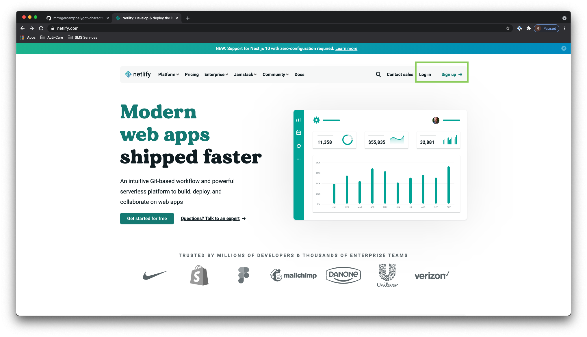
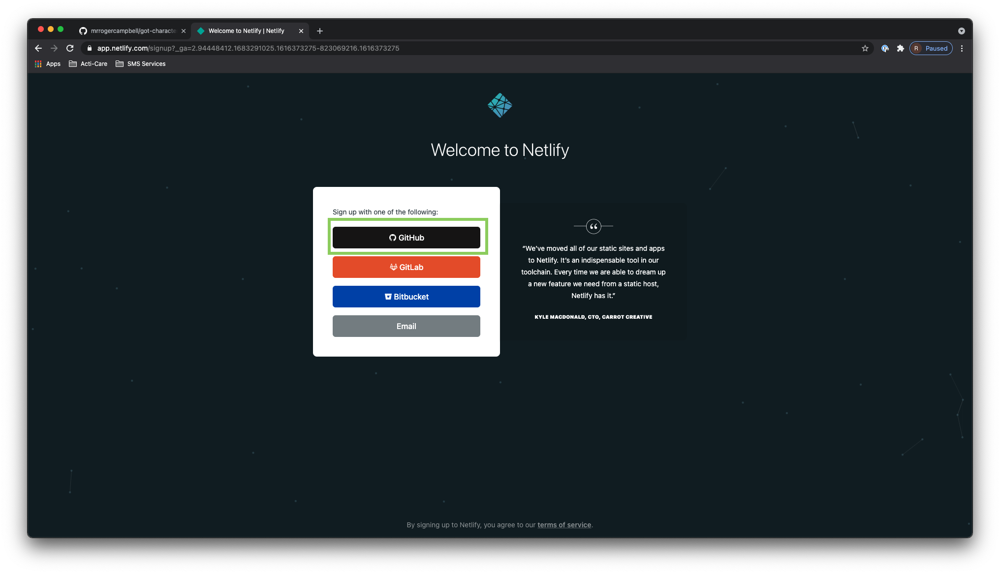
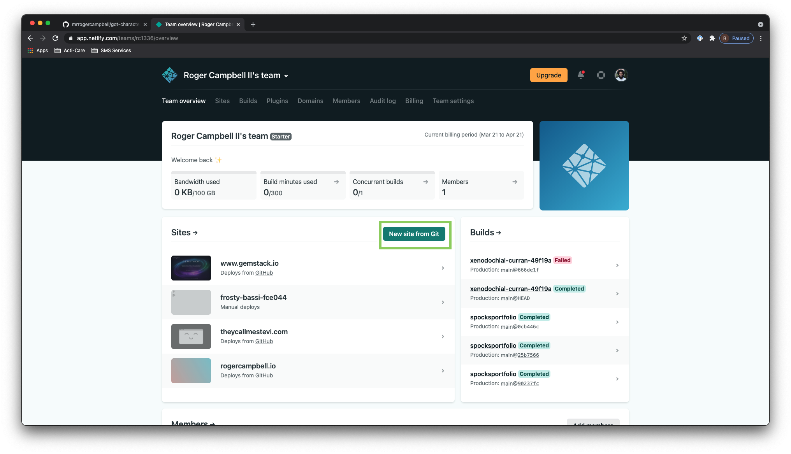
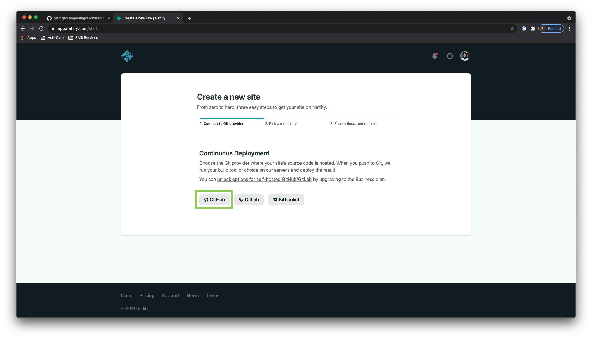
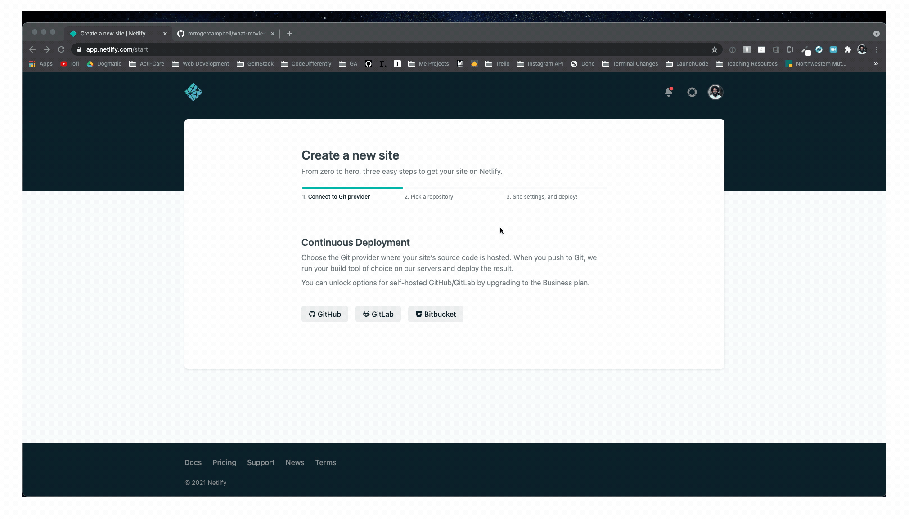
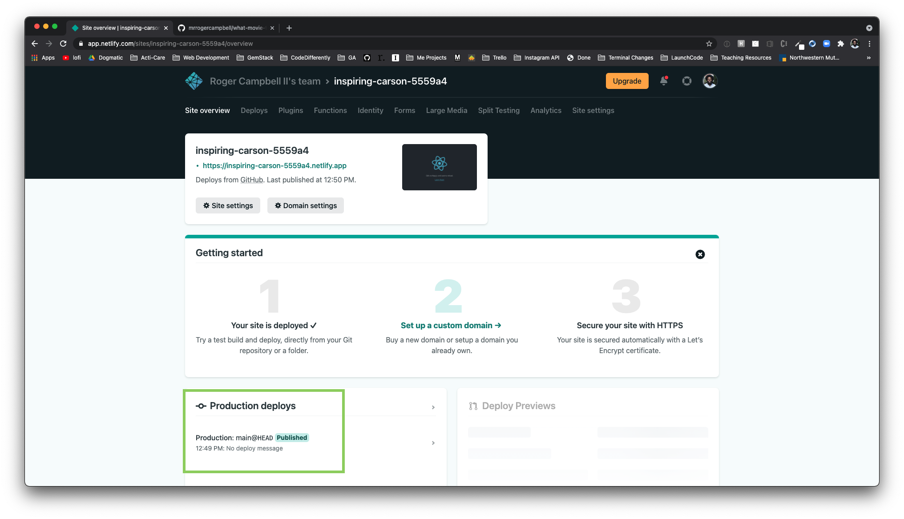
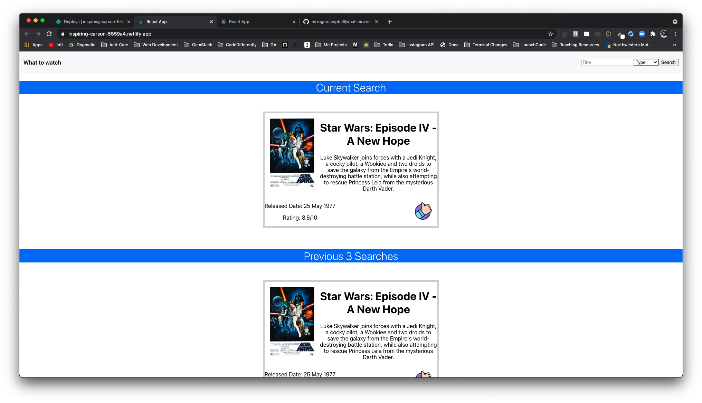

# Movie App Walkthrough
## Project Setup
1. Via the terminal create a React project called  `what-movie-to-watch`
	*  `npx create-react-app what-movie-to-watch`
2. While you wait navigate to [GitHub](https://github.com/) and create a remote repo called   `what-movie-to-watch`
3. Once the React Project is created, via the terminal connect the local repo to the remote repo
	* You can copy and paste the `*…or push an existing repository from the command line*` code snippet into the terminal and it will do the work for you
		* *Be sure that you are cd’d into the React project before pasting this code snippet*
4. Navigate into the `what-movie-to-watch` project 
	* `cd what-movie-to-watch`
4. Create a `components` directory
	*  `mkdir src/components`
3. Create a `Header` , `MovieGallery`, and `MovieCard` component within the `components` directory
	* `touch src/components/Header.js src/components/MovieGallery.js src/components/MovieCard.js`

## Setup API
1. Navigate to [omdbapi](https://www.omdbapi.com) and *read the documentation*
	* Biggest thing to walk away with here is how do I query the data I need?
2. Sign up for an `API Key `
3. Check the email , copy and store the `API Key` within you app
	* In this example we will be utilizing the API Key within our app this is a bad practice be sure to read up on how to [Adding Custom Environment Variables](https://create-react-app.dev/docs/adding-custom-environment-variables/)
4. Create a `data.json` file within the `src` directory 
5. Utilize the API Key to send a request via the browser for one movie record
	* https://www.omdbapi.com/?apikey=47fad17f&t=star%20trek
6. Copy the data that is return 
7. Create a `movieData.json` file within the `src` directory
	* `touch src/movieData.json`
8.  Paste the data that was copied in step 6 into the `movieData.json` file
```js
// movieData.json
{
		"Title": "Star Trek",
		"Year": "2009",
		"Rated": "PG-13",
		"Released": "08 May 2009",
		"Runtime": "127 min",
		"Genre": "Action, Adventure, Sci-Fi",
		"Director": "J.J. Abrams",
		"Writer": "Roberto Orci, Alex Kurtzman, Gene Roddenberry (television series \"Star Trek\")",
		"Actors": "Chris Pine, Zachary Quinto, Leonard Nimoy, Eric Bana",
		"Plot": "The brash James T. Kirk tries to live up to his father's legacy with Mr. Spock keeping him in check as a vengeful Romulan from the future creates black holes to destroy the Federation one planet at a time.",
		"Language": "English",
		"Country": "USA, Germany",
		"Awards": "Won 1 Oscar. Another 26 wins & 95 nominations.",
		"Poster": "https://m.media-amazon.com/images/M/MV5BMjE5NDQ5OTE4Ml5BMl5BanBnXkFtZTcwOTE3NDIzMw@@._V1_SX300.jpg",
		"Ratings": [
		{
		"Source": "Internet Movie Database",
		"Value": "7.9/10"
		},
		{
		"Source": "Rotten Tomatoes",
		"Value": "94%"
		},
		{
		"Source": "Metacritic",
		"Value": "82/100"
		}
		],
		"Metascore": "82",
		"imdbRating": "7.9",
		"imdbVotes": "580,264",
		"imdbID": "tt0796366",
		"Type": "movie",
		"DVD": "01 Aug 2013",
		"BoxOffice": "$257,730,019",
		"Production": "Bad Robot",
		"Website": "N/A",
		"Response": "True"
}
```

## Render a Single MovieCard Within a MovieGallery
1. Delete the `App.css` file
2. Remove all CRA template code from the `App` component, and import the following:
	1.  `MovieGallery` component
	2.  `data.json` file
```js
// App.js
import MovieGallery from './components/MovieGallery'
import movieData from './movieData.json'

function App() {
  return (
    <div className="App">
     
    </div>
  )
}

export default App
```
2.  Render the `MovieGallery`  component within the `App` component
```js
// App.js
import movieData from './movieData.json'
import MovieGallery from './components/MovieGallery'

function App() {
  return (
    <div className="App">
     <MovieGallery/>
    </div>
  );
}

export default App;
```
4. Pass the imported json data to the `MovieGallery` component as props
```js
// App.js
import data from './data.json'
import MovieGallery from './components/MovieGallery'

function App() {
  return (
    <div className="App">
     <MovieGallery movieData={movieData}/>
    </div>
  );
}

export default App;
```
6. Open the `MovieGallery.js` file and create a functional component
```js
// MovieGallery.js
import React from 'react';

const MovieGallery = () => {
    return (
        <div>
            
        </div>
    );
};

export default MovieGallery;
```
8. Check to see if the `MovieGallery`  component is receiving the the `movieData` prop
```js
// MovieGallery.js
import React from 'react';

const MovieGallery = (props) => {
    console.log(props)
    return (
        <div>

        </div>
    );
};

export default MovieGallery;
```
9. Import and render the `MovieCard` component within the `MovieGallery` component
```js
// MovieGallery.js
import React from 'react';
import MovieCard from './MovieCard'

const MovieGallery = (props) => {
    return (
        <div>
        <MovieCard/>
        </div>
    );
};

export default MovieGallery;
```
10. Pass the `movieData` prop to the `MovieCard` component as props
	* *Gotcha:*
		* Refactor the `MovieGallery` component so that it destructure  props and just expects `movieData` 
			* More info can be found here: [Destructuring Props in React](https://medium.com/@lcriswell/destructuring-props-in-react-b1c295005ce0)
```js 
// MovieGallery.js
import React from 'react';
import MovieCard from './MovieCard'

const MovieGallery = ({movieData}) => {
    return (
        <div>
        <MovieCard {...movieData}/>
        </div>
    );
};

export default;

```
10. Open the `MovieCard.js` file and create a functional component and check to see that it is successfully receiving the `movieData` prop
```js
// MovieCard.js
import React from 'react';

const MovieCard = (props) => {
    console.log(props)
    return (
        <div>

        </div>
    );
};

export default MovieCard;
```
11. Refactor the `MovieCard`  component to render the `Poster`, `Title`, `Plot`, `Released`, `imdbRating`
```js
// MovieCard.js
import React from 'react';

const MovieCard = ({ Poster, Title, Plot, Released, imdbRating }) => {
    return (
        <div>
            
            <h1>{Title}</h1>
            <p>{Plot}</p>
            <div>
                <div>
                    <p>Released Date: {Released}</p>
                    <p>Rating: {imdbRating}/10</p>
                </div>
            </div>
        </div>
    );
};

export default MovieCard;
```

## Refactor Static Data For API Data
1. Instantiate state within the `App` component
	* Declare a `state variable` called `movieData` 
	* Declare a `state update function` called `setMovieData`
	* Set the states initial value equal to an `empty array`
		* *Gotcha:* This will cause the movie to stop render, no fear this will be fixed momentarily 
```js
// App.js
import { useState } from 'react'
import movieData from './movieData.json'
import MovieGallery from './components/MovieGallery'

function App() {
  const [movieData, setMovieData] = useState([])

  return (
    <div className="App">
      <MovieGallery movieData={movieData} />
    </div>
  );
}

export default App;
```
2. In the `App` component create a function called `fetchMovieData`
	* This function should send an api request to `https://www.omdbapi.com/?apikey=47fad17f&t=star%20trek` and store the response data with in the `movieData` state object
	* *Be sure to invoke your function within a useEffect*
```js
// App.js
import { useEffect, useState } from 'react'
import MovieGallery from './components/MovieGallery'

function App() {
  const [movieData, setMovieData] = useState([])

  const fetchMovieData = (searchParam) => {
    let URL = `https://www.omdbapi.com/?apikey=47fad17f&t=star%20trek`

    fetch(URL)
      .then(res => res.json())
      .then(jsonData => setMovieData(jsonData))
  }

  useEffect(()=> {
    fetchMovieData()
  }, [])

  return (
    <div className="App">
      <MovieGallery movieData={movieData} />
    </div>
  );
}

export default App;
```


## Implement User Search Functionality
1.  Open the `Header` file and create a functional component
```js
// Header.js
import React from 'react';

const Header = () => {
    return (
        <div>
            
        </div>
    );
};

export default Header;
```
2. Within the `Header` component create the following:
	* An `input field` where a user can provide the name of a film   
	* A `select` dropdown menu where a user can select the type of film
		* It should have the following options:
			* `Type` this should be hidden
			* `Movies`
			* `Series`
			* `Episode`
				* Be sure each option’s `name` attribute value matches the  `Valid Options` dictated for a `type` parameter query
					* More info on this can be found within the `Parameters` section of [OMDb API - The Open Movie Database](https://www.omdbapi.com/) documentation
	* A `submit` button to submit their search
	* Also add a `h1` with the innerHtml of  `What to watch` ; as shown in the mock
```js
// Header.js
const Header = () => {

    return (
        <div>
            <h1>What to watch</h1>
            <div>
                <input
                    type='text'
                    placeholder='Title'
                />
                <select
                    id="selection"
                    name="selection"
                    placeholder='Type'
                >
                    <option value="" hidden >Type</option>
                    <option value="movie">Movies</option>
                    <option value="series">Series</option>
                    <option value="episode">Episode</option>
                </select>
                <button>Search</button>
            </div>
        </div>
    );
};

export default Header
```
3. Instantiate two state  `variables` within the `Header` component
	1.  `searchedValue` and `setSearchedValue` - will be used to track the user typed selection 
	2. `selectedTypeValue` and `setSelectedTypeValue` - will be used to track the users dropdown selection
```js
// Header.js
import { useState } from 'react'

const Header = () => {
    const [searchedValue, setSearchedValue] = useState('')
    const [selectedTypeValue, setSelectedTypeValue] = useState('')

    return (
		// ... Space Saving Do not remove exisiting code
    );
};

export default Header
```
4. Next within the `Header` component create the following functions:
	1. `handleInput` - Will update the value of `searchedValue` for every user keystroke
	2. `handleSelectChange` - Will update the value of `selectChange` each time the user select an option in the dropdown menu
	3.  `handleClick` - Will trigger the `fetchMovieData` function
```jsx
import React, { useState } from 'react'
import '../styles/Search.css'

const Header = () => {
    const [searchedValue, setSearchedValue] = useState('')
    const [selectedTypeValue, setSelectedTypeValue] = useState('')

    const handleInput = (e) => {
        e.preventDefault()
        setSearchedValue(e.target.value)
    }

    const handleSelectChange = (e) => {
        e.preventDefault()
        setSelectedTypeValue(e.target.value)
    }

    const handleClick = (e) => {
        e.preventDefault()
        fetchMovieData(searchedValue, selectedTypeValue)
    }

    return (
		// ... Space Saving Do not remove exisiting code
    );
};

export default Header
```
5. Added each function to its corresponding `JSX Element`:
	* `handleInput` should be set as the `input` tag’s `onChange`  method
	* `handleSelectChange` should be set as the `select` tag’s `onChange`  
	* `handleClick` should be set as the `button` tag’s  `onClick` method
```js
// Header.js
const Header = () => {
		// ... Space Saving Do not remove exisiting code
    return (
        <div>
            <h1>What to watch</h1>
            <div>
                <input
						type='text'
						placeholder='Title'
						onChange={handleInput}
                />
                <select
                    id="selection"
                    name="selection"
                    placeholder='Type'
                    onChange={handleSelectChange}
                >
                    <option value="" hidden >Type</option>
                    <option value="movie">Movies</option>
                    <option value="series">Series</option>
                    <option value="episode">Episode</option>
                </select>
                <button onClick={handleClick}>Search</button>
            </div>
        </div>

    );
};

export default Header
```
6. Update the `Header` component so that it expects to receive the `fetchMovieData` function as props from the `App` component
```jsx
import React, { useState } from 'react'
import '../styles/Search.css'

const Header = ({fetchMovieData}) => {
	// ... Space Saving Do not remove exisiting code
};

export default Header
```
7. Refactor the `App` component so that it is now rendering the `Header` component
```js
// App.js
import { useEffect, useState } from 'react'
import MovieGallery from './components/MovieGallery'
import Header from './components/Header'

function App() {
  const [movieData, setMovieData] = useState([])

  const fetchMovieData = (searchParam) => {
    let URL = `https://www.omdbapi.com/?apikey=47fad17f&t=star%20trek`

    fetch(URL)
      .then(res => res.json())
      .then(jsonData => setMovieData(jsonData))
  }

  useEffect(()=> {
    fetchMovieData()
  }, [])

  return (
    <div className="App">
      <Header />
      <MovieGallery movieData={movieData} />
    </div>
  );
}

export default App;

```

8.  In the `App` refactor the `fetchMovieData` function so that it accepts `searchedValue` and `selectedTypeValue` as parameters
	* Then test to see if the arguments are being passed correctly
```js
// App.js
		
// ... Space Saving Do not remove exisiting code
function App() {
  const [movieData, setMovieData] = useState([])

	const fetchMovieData = (searchedValue, selectedTypeValue) => {
    console.log(`selectedTypeValue: ${selectedTypeValue}`)
    console.log(`searchedValue: ${searchedValue}`)
    
		let URL = `https://www.omdbapi.com/?apikey=47fad17f&t=star%20trek`

    console.log('fired')

    fetch(URL)
      .then(res => res.json())
      .then(jsonData => setMovieData(jsonData))
  }

 		// ... Space Saving Do not remove exisiting code
  return (
  		// ... Space Saving Do not remove exisiting code
  );
}

export default App;
```
8. In the `App` component refactor the `URL` variable’s value so that it utilizes `searchedValue` and `selectedTypeValue` as a part of the query string
	* *Gotchas:* 
		* A potential side effect can happen if a user was to not provide a type value so to forego any issues provide `selectedTypeValue` with a default value of `null`
		* Be sure to update the  `fetchMovieData` inside the `useEffect` so that an argument is provided for  `searchedValue` parameter
		* Be sure to remove the logging from the `fetchMovieData` function
```js
// App.js

// ... Space Saving Do not remove exisiting code
function App() {
  const [movieData, setMovieData] = useState([])

	const fetchMovieData = (searchedValue, selectedTypeValue = null
) => {
		 let URL = `https://www.omdbapi.com/?apikey=47fad17f&t=${searchedValue}&type=${selectedTypeValue}`

    fetch(URL)
      .then(res => res.json())
      .then(jsonData => setMovieData(jsonData))
  }

  useEffect(() => {
    fetchMovieData('star wars')
  }, [])

  return (
  		// ... Space Saving Do not remove exisiting code
  )
}

export default App;
```

## Refactor MovieGallery Component to be Reusable Pt. 1
1. Refactor the `MovieGallery` component so that it destructure props and ingest the following:
	* `moiveData` — will be the data returned from the api call
	* `title` — Is the title of the component
		* ie: `Current Search` or `Previous 3 Searches` 
	* `recentGallery` — a Boolean value to inform the component of wether it should render as a `Current Search` gallery or `Previous 3 Searches` gallery
```js
// MovieGallery.js

import React from 'react'
import MovieCard from './MovieCard'

const MovieGallery = ({ movieData, title, recentGallery }) => {
    return (
        <div>
            <MovieCard {...movieData} />
        </div>
    )
}

export default MovieGallery;
```
2. Render the `title` prop as an `h1` above the `MovieCard` component
```js
// MovieGallery.js

import React from 'react'
import MovieCard from './MovieCard'

const MovieGallery = ({ movieData, title, recentGallery }) => {
    return (
        <div>
            <h1>{title}</h1>
            <MovieCard {...movieData} />
        </div>
    )
}

export default MovieGallery;
```
3. Refactor the `App` component to render *two* instances of the `MovieGallery` component
	1. Pass the first instance the following props:
		* `title` and set its value equal to the string `'Current Search'`
		* `movieData` and set its value equal to the state object `movieData`
		* `recentGallery` and set its value equal to `false`
	2. Pass the second instance the following props:
		* `title` and set its value equal to the string  `’Previous 3 Searches’`
		* `movieData` and set its value equal to the state object `movieData`
		* `recentGallery` and set its value equal to `true`
```js
// App.js

// ... Space Saving Do not remove exisiting code

function App() {
  // ... Space Saving Do not remove exisiting code

  return (
    <div className="App">
      <Header fetchMovieData={fetchMovieData} />

      <MovieGallery title={'Current Search'} movieData={movieData} recentGallery={false} />

      <MovieGallery title={'Previous 3 Searches'} movieData={movieData} recentGallery={true} />

    </div>
  );
}

export default App;
```
4. Refactor the `MovieGallery` component so that it instantiates two new state objects and set both of their initials values equal to an *empty array*
	1. `previousMovies`
	2. `currentMovie`
		* *Gotcha:*
			* Be sure to import the `useState` method
```js
// MovieGallery.js

import React, {useState } from 'react'
import MovieCard from './MovieCard'

const MovieGallery = ({ movieData, title, recentGallery }) => {
    const [previousMovies, setPreviousMovies] = useState([])
    const [currentMovie, setCurrentMovie] = useState([])

    return (
        <div>
            <h1>{title}</h1>
            <MovieCard {...movieData} />
        </div>
    )
}

export default MovieGallery;
```
5. Continue refactoring the `MovieGallery` component by adding a `useEffect` that watches for updates to the `movieData` component and on effect sets the value of `previousMovies` and `currentMovie`
	* *Gotcha:*
		* Be sure to import the `useEffect` method
		* We can utilize the `// eslint-disable-next-line react-hooks/exhaustive-deps` here to remove the `dependency` error that is triggered here
  		* This is not a production solution this is a quick fix for the shake of this example
  		* More info on this here: [Is it safe to omit functions from the list of dependencies?](https://reactjs.org/docs/hooks-faq.html#is-it-safe-to-omit-functions-from-the-list-of-dependencies)
```js
// MovieGallery.js

import React, { useEffect, useState } from 'react'
import MovieCard from './MovieCard'

const MovieGallery = ({ movieData, title, recentGallery }) => {
    const [previousMovies, setPreviousMovies] = useState([])
    const [currentMovie, setCurrentMovie] = useState([])

    useEffect(() => {
        setCurrentMovie(movieData)
        setPreviousMovies(previousMovies.concat(movieData))
        // eslint-disable-next-line react-hooks/exhaustive-deps
    }, [movieData]);

    return (
        <div>
            <h1>{title}</h1>
            <MovieCard {...movieData} />
        </div>
    )
}

export default MovieGallery;
```
1. Continue refactoring the `MovieGallery` component so that it contains two variables that perform the following logic:
	1. `listOfMovieCards` — this should store an array of `MovieCard` components based on a  `map`  method which iterates over the `previousMovies` state object.
		* Each instance of the `MovieCard` component that is stored should receive the single instance of movie data that is being iterated over
	2. `singleMovieCard` — should store a single instance of the `MovieCard` component which receives the `currentMovie` state object as a prop
```js
// MovieGallery.js

import React, { useEffect, useState } from 'react'
import MovieCard from './MovieCard'

const MovieGallery = ({ movieData, title, recentGallery }) => {
  // ... Space Saving Do not remove exisiting code

    const listOfMovieCards = previousMovies.map((movie, i) => {
        return <MovieCard {...movie} key={i} />
    })

    const singleMovieCard = <MovieCard {...currentMovie} />

    return (
         // ... Space Saving Do not remove exisiting code
};

export default MovieGallery;
```
7. Continue refactoring the `MovieGallery` component so that it declares a function called `renderMovie`  which performs a check to see whether it should return either the `listOfMovieCards` or `singleMovieCard` variable
	* *Gotcha:*
		* *Be sure to remove* the initial `MovieCard` component that was being render and replace it with a the invocation of `renderMovie` function
```js
// MovieGallery.js

import React, { useEffect, useState } from 'react'
import MovieCard from './MovieCard'

const MovieGallery = ({ movieData, title, recentGallery }) => {
  // ... Space Saving Do not remove exisiting code

    const listOfMoviesCards = previousMovies.map((movie, i) => {
        return <MovieCard {...movie} key={i} />
    })

    const singleMovieCard = <MovieCard {...currentMovie} />

    let renderMovie = () => (recentGallery === true) ? listOfMovieCards : singleMovieCard

    return (
        <div>
            <h1>{title}</h1>
            {renderMovie()}
        </div>
    );
};

export default MovieGallery;
```
8. With the current logic there is a nasty side effect happen due to the initial api call being performed in the `App` component.
	* To fix this refactor the `App` component so that it no longer performs the initial `fetchMovieData` function on render and instead set `movieData`’s initial state value equal to the JSON data
## Add Styling
1. Within the `src` directory create a `style` directory
	* `mkdir src/style`
2. Within the `style` directory create a `styles.css`  files and added this code to it:
	* `touch src/style/styles.css`
```css
/* styles.css */

/* App Component Styles */
.App{
  display: flex;
  flex-direction: column;
}

/* MovieCard Component Styles */
.movie{
  /* height: auto; */
  width: 500px;
  border: lightgrey 5px solid;
  margin: 10px;
}

.ratings-container{
  display: flex;
  flex-wrap: wrap;
  justify-content: space-between;
}

img{
  width: auto;
  height: 200px;
  float: left;
  margin: 15px;
}

/* MovieGallery Styles */
.container {
    width: 100%;
}

.movie-gallery-container{
    margin: 10px;
    padding: 20px 0;
    display: flex;
    flex-wrap: wrap;
    align-items: center;
    justify-content: center;
}

.title{
    background: #0071fa;
    color: white;
    text-align: center;
    font-weight: 300;
}

/* Header Component Styles */
.container-header {
  display: flex;
  justify-content: space-between;
  padding: 12px;
  align-items: center;
  background-color: #f7f8f9;
}

.what-title{
  font-weight: 600;
  font-size: medium;
}

/* Thumb Component Styles */
.thumb-icon{
    height: 50px;
}
```
3. Import the `styles.css` file into the `App` component
```js
// App.js

// ... Space Saving Do not remove exisiting code
import './style/styles.css'

function App() {
// ... Space Saving Do not remove exisiting code
  return (
    <div className="App">
     // ... Space Saving Do not remove exisiting code
    </div>
  );
}

export default App;
```

5. Refactor each component with the following classes
	* *Gotcha*: just copy and paste the code below inside each component
```js
// App.js

// ... Space Saving Do not remove exisiting code

function App() {
// ... Space Saving Do not remove exisiting code
  return (
    <div className="App">
      <Header fetchMovieData={fetchMovieData} />
      <MovieGallery title={'Current Search'} movieData={movieData} recentGallery={false} />
      <MovieGallery title={'Previous 3 Searches'} movieData={movieData} recentGallery={true} />
    </div>
  );
}

export default App;


```
```js
// Header.js

// ... Space Saving Do not remove exisiting code

const Header = ({ fetchMovieData }) => {
  // ... Space Saving Do not remove exisiting code

    return (
        <div className='container-header'>
            <h1 className='what-title'>What to watch</h1>
            <div>
                <input
                    type='text'
                    placeholder='Title'
                    onChange={handleInput}
                />
                <select
                    id="selection"
                    name="selection"
                    placeholder='Type'
                    onChange={handleSelectChange}
                >
                    <option value="" hidden >Type</option>
                    <option value="movie">Movies</option>
                    <option value="series">Series</option>
                    <option value="episode">Episode</option>
                </select>
                <button onClick={handleClick}>Search</button>
            </div>
        </div>
    );
};

export default Header

```

```js
// MovieGallery.js

// ... Space Saving Do not remove exisiting code

const MovieGallery = ({ movieData, title, recentGallery }) => {
  // ... Space Saving Do not remove exisiting code

    return (
        <div>
            <h1 className='title'>{title}</h1>
            <div className='movie-gallery-container'>
                {renderMovie()}
            </div>
        </div>
    );
};

export default MovieGallery;

```

```js
import React from 'react';

const MovieCard = ({ Poster, Title, Plot, Released, imdbRating }) => {
    return (
        <div className="movie">
            
            <h1>{Title}</h1>
            <p>{Plot}</p>
            <div className='ratings-container'>
                <div className='ratings-text'>
                    <p>Released Date: {Released}</p>
                    <p>Rating: {imdbRating}/10</p>
                </div>
            </div>
        </div>
    );
};

export default MovieCard;
```

## Refactor MovieGallery Component to be Reusable Pt. 2
1. Finally within the `MovieGallery` component perform a check to see if `previousMovies` length is greater than 3; if it is remove the first item within the `previousMovies` state object and update its state.
```js 
// MovieGallery.js

// ... Space Saving Do not remove exisiting code

const MovieGallery = ({ movieData, title, recentGallery }) => {
  // ... Space Saving Do not remove exisiting code

    let renderMovie = () => (recentGallery === true) ? listOfMovieCards : singleMovieCard

    if (previousMovies.length > 3) {
        previousMovies.splice(0, 1)
        setPreviousMovies(previousMovies)
    }

    return (
 		// ... Space Saving Do not remove exisiting code
    );
};

export default MovieGallery;
``` 
## Refactor MovieCard Component to Dynamically Render Thumb Icons
1. Within the `components` directory create a `Thumb.js` file
	* `touch src/components/Thumb.js`
2. Within the `src` directory create an `assets` directory
	* `mkdir src/assets`
3. Download and save the [thumb-up.png](./src/assets/thumb-up.png) and [thumb-down.png](./src/assets/thumb-down.png)  PNGs and store them within the `assets` directory
	* If for some reason these links no longer work you are free to use any icons you’d like here
4. Within the `Thumb.js` file create a functional component that destructure props and ingest `imdbRating`
```js
// Thumb.js
import React from 'react'

const Thumb = ({imdbRating}) => {
    return (
        <div>
            
        </div>
    );
};

export default Thumb;
```
5. Import the `thumb-up.png` and  `thumb-down.png` files into the `Thumb` component
```js
// Thumb.js
import React from 'react'
import ThumbsUp from '../assets/thumb-up.png'
import ThumbsDown from '../assets/thumb-down.png'

const Thumb = ({imdbRating}) => {
    return (
        <div>
            
        </div>
    );
};

export default Thumb;
```
6. Next within the `Thumb` component create a `thumbsUpIcon` and `thumbsDownIcon` variable each of which should store a jsx `img` tag which source is equal to its corresponding png file
```js
// Thumb.js
import React from 'react'
import ThumbsUp from '../assets/thumb-up.png'
import ThumbsDown from '../assets/thumb-down.png'

const Thumb = ({imdbRating}) => {
    const thumbsUpIcon = 

    const thumbsDownIcon = 

    return (
        <div>
            
        </div>
    );
};

export default Thumb;
```
7. Then  within the `Thumb` component perform a check to see if `imdbRating`  value is greater than 5 return the `thumbsUpIcon` icon; else return the `thumbsDownIcon`
	* *Gotcha:* Be sure to reference the `ratingCheck` variable inside the `Thumb` components return
```js
// Thumb.js

// ... Space Saving Do not remove exisiting code

const Thumb = ({imdbRating}) => {
    const thumbsUpIcon = 

    const thumbsDownIcon = 

    const ratingCheck = imdbRating > 5 ? thumbsUpIcon : thumbsDownIcon
    
return (
        <div>
            {ratingCheck}
        </div>
    );

};

export default Thumb;
```
8. Finally, import the `Thumb` component within the `MovieCard` component and render it right after the closing of the `.ratings-text` div
	* *Gotcha:* Don’t forget to pass the `imdbRating` down as a prop to the `Thumb` component
```js
// MovieCard.js
import React from 'react'
import Thumb from './Thumb'

const MovieCard = ({ Poster, Title, Plot, Released, imdbRating }) => {
    return (
        <div className="movie">
            
            <h1>{Title}</h1>
            <p>{Plot}</p>
            <div className='ratings-container'>
                <div className='ratings-text'>
                    <p>Released Date: {Released}</p>
                    <p>Rating: {imdbRating}/10</p>
                </div>
                <Thumb imdbRating={imdbRating} />
            </div>
        </div>
    );
};

export default MovieCard;
```

## Deploy to Netlify
1. Be sure that all code is commit and pushed to the remote repo before starting this section 
2. Go to [Netlify](_https://www.netlify.com/_) and either login or sign up for an account
   * Signing Up:
     * Click the sign up button
     * Select the GitHub button
     * Authorize Netlify to have access to your GitHub
   * Signing In:
      1. Click the sign in button
      2. Sign in with whichever way you signed up before
    
3. Click the `New site from Git` button
    
4.  Click the `GitHub` button
    
5.  Walk through the prompts and be sure to select the `All Repositories` option in the `Repository access` section
    
6.  Search for the `what-movie-to-watch` repo and select it
7. Leave all the default setting that are presented and press `Deploy site`
    
8. Wait for the sire to deploy
    *  This might take a few minutes…
    
9. Once Deployed click the deployed link
    * Example: `https://relaxed-hawking-4cc4a7.netlify.app/`
    