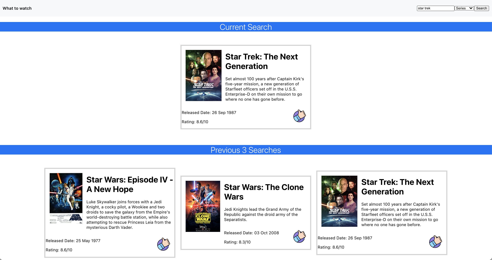

# What Movie to Watch Take Home Challenge

## Instructions:
* Build a React project that fulfills all requirements listed below
* Submit links to your github repo and deployed project via this [Google Form](#)

## Part 1: What to Watch

* **Goal**: Create a simple React application that given a movie title and type will return the movie information from Open Movie Database. It will also keep the last 3 searches in memory

* **Example**: When given the title symbol Spongebob, your application should use the open movie database to return: the summary of the show, its release date, and ranking. If the ranking is above a 5, display a thumbs up. If it’s below a 5, display a thumbs down.

## Requirements:
* The application should ingest and render data from the [Open Movie Database](https://www.omdbapi.com/) based on user input.
  * You will need to read the documentation to learn how to interact with the API.
* This application must be deployed via Netlify, GitHub, etc.
* The application should consist of the following components:
  * **Header** - This component should contain a search bar that allows users to search for a film by providing the name of the film via a text field and the option to select the type of film via a dropdown menu
  * **Movie Card Container** - This component should be rendered twice within your application.The first instance should render the current film that has been searched
    * The second should render a gallery of the two previously searched movies as well as the current film.
  * **Movie Card** - This component should render the following data about a film:
      * Title
      * Description
      * Release Date
      * Rating
      * Thumb Icon - If the film’s rating is greater than 5 then it should render a thumbs up icon, else it should render a thumbs down icon
* Notes:
  * You may use any libraries you think you'll need to complete the task
  * [Working Demo](https://relaxed-hawking-4cc4a7.netlify.app/)

